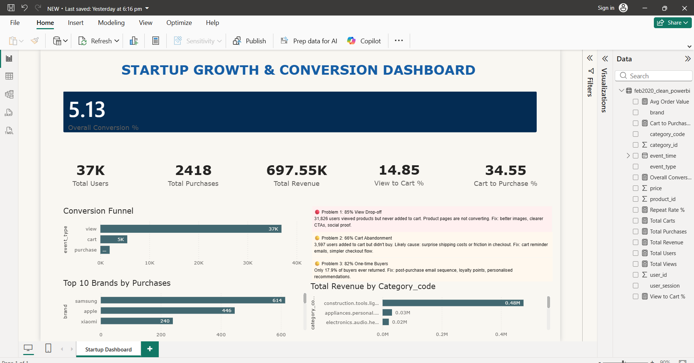

# Startup Growth & Conversion Dashboard 
### PM + Analyst Portfolio Project | Power BI + DAX

## North Star Metric: 5.13% Overall Conversion
173,198 real e-commerce events analyzed. Only 5.13% of viewers purchase.

## Key Findings
- 37,287 Daily Active Users
- $697K Total Revenue | $288 Avg Order Value
- 14.85% View→Cart | 34.55% Cart→Purchase
- 85.1% drop-off at product page (biggest problem)
- 17.85% repeat buyer rate (retention gap)

## Tools Used
Power BI Desktop | Power Query | DAX | Excel

## Dataset
Kaggle: Ecommerce Behavior Data from Multi-Category Store (Feb 2020)
